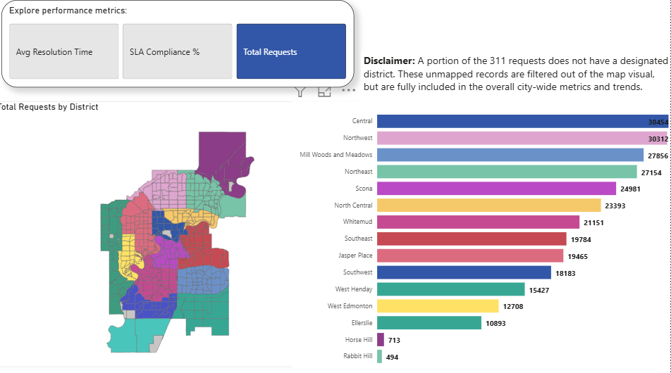
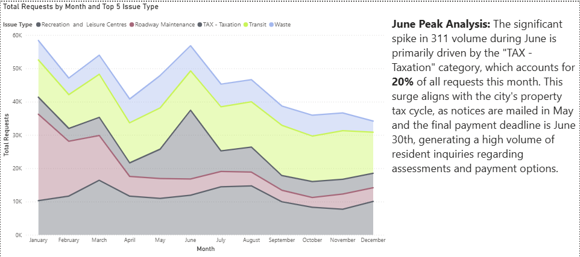

# 🏙️ Edmonton 311 Service Requests Analysis

## 📌 Project Overview
I developed an interactive Power BI dashboard analyzing the city's 311 service requests across its 15 regional districts.

This project transforms a large public dataset into an operational diagnostic tool, shifting the focus from descriptive analytics (what happened) to actionable insights (why it happened).

## 🛠️ Tools & Technologies Used
* **Power BI:** Data visualization, interactive dashboard design.
* **Power Query / M Language:** Data extraction, transformation, and cleaning (ETL).
* **DAX (Data Analysis Expressions):** Custom measures for SLA compliance, average resolution time, and dynamic filtering.

## 📊 Key Insights & Findings

### 1. The June Operational Bottleneck
Through seasonal trend analysis (Stacked Area Chart), I identified a massive spike in 311 call volumes during the month of June. 
* **The Root Cause:** A deep dive revealed this surge is heavily driven by the **"TAX - Taxation"** category. 
* **Business Context:** This aligns with the municipal property tax cycle, where notices are mailed in May and payments are due on June 30th. 
* **Actionable Recommendation:** This insight suggests a critical need for the 311 center to proactively scale up staffing and prioritize tax-related queue management during the May-June window.

### 2. District-Level SLA Compliance
* Analyzed request distributions across 15 operational districts.
* Highlighted the correlation between specific geographical areas, the types of issues reported, and the impact on the overall Service Level Agreement (SLA) compliance percentages. *(Note: Unmapped "Not Specified" data was deliberately filtered out of geographic visuals to maintain spatial accuracy, while remaining in overall KPI calculations).*

## 📸 Dashboard Previews

## 🚀 How to Open the Project
1. Clone this repository to your local machine.
2. Ensure you have [Power BI Desktop](https://powerbi.microsoft.com/desktop/) installed.
3. Open the `311_Requests_Dashboard.pbix` file.
4. Alternatively, you can view the static report in the `311_Requests_Report.pdf` file included in this repository.

---
*Feel free to reach out on [LinkedIn](www.linkedin.com/in/kelvin-carvalho-217a0527a) if you'd like to discuss this project, data analytics, or business intelligence strategies.*
